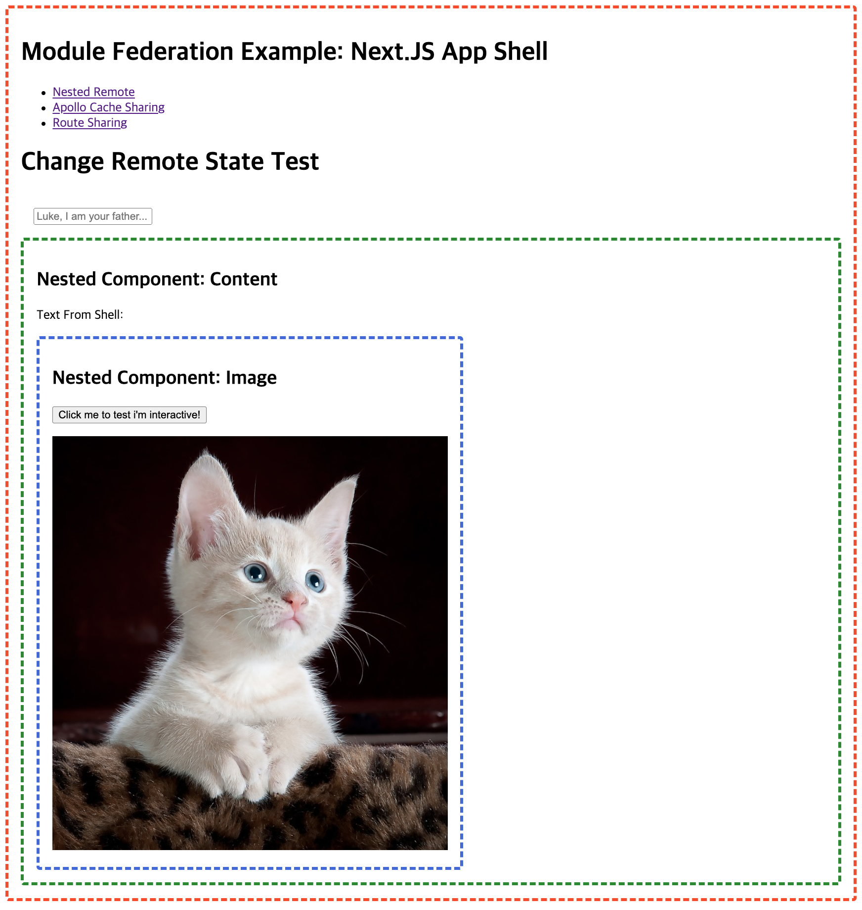
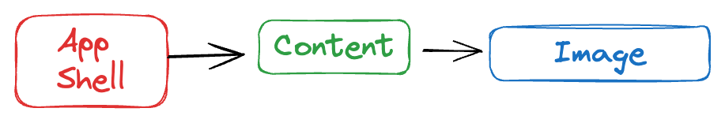
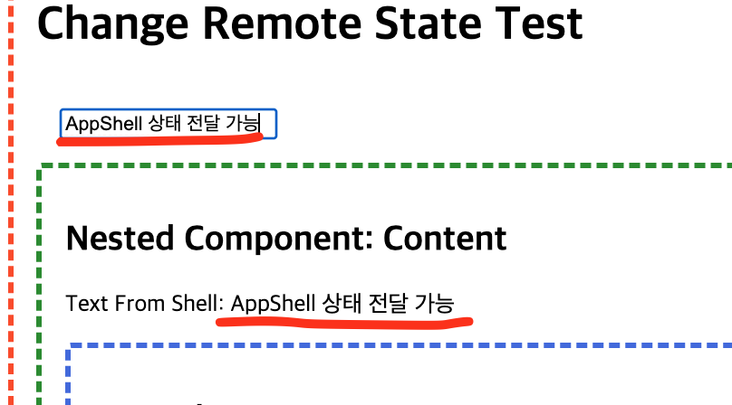
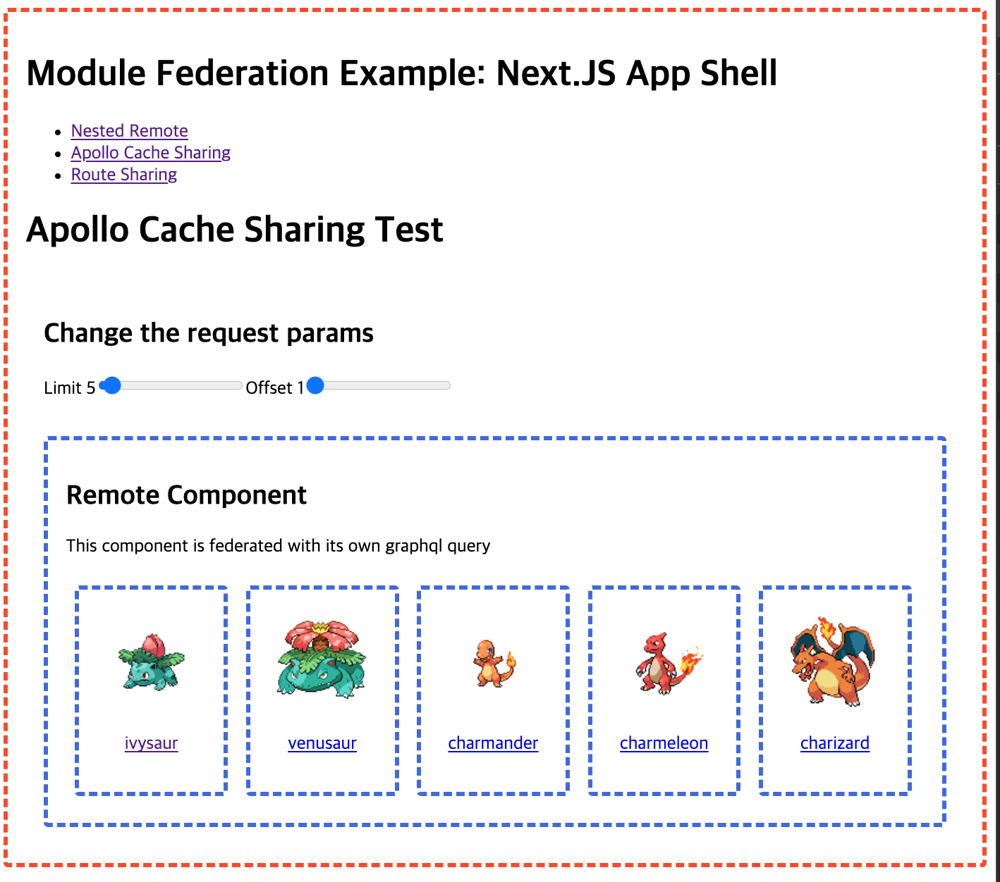
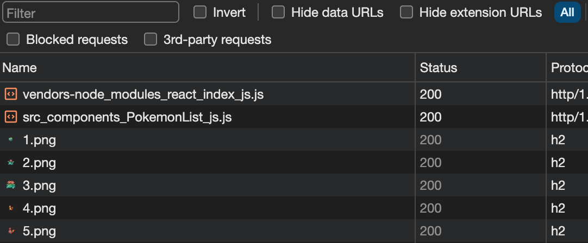
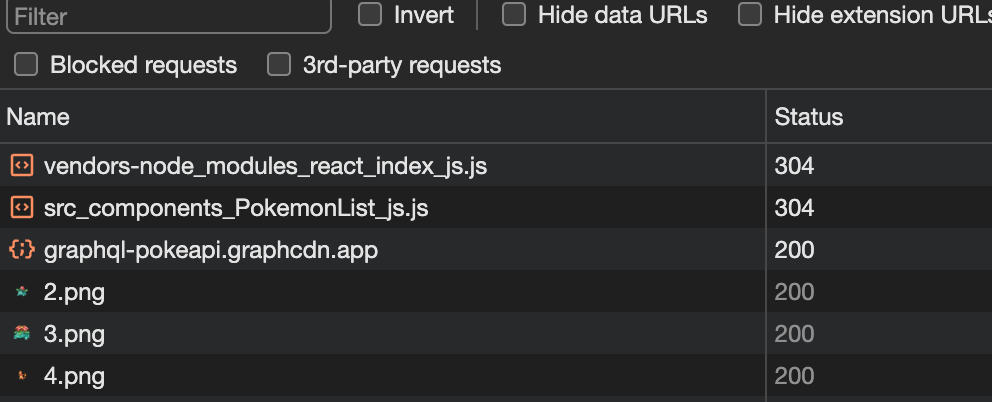
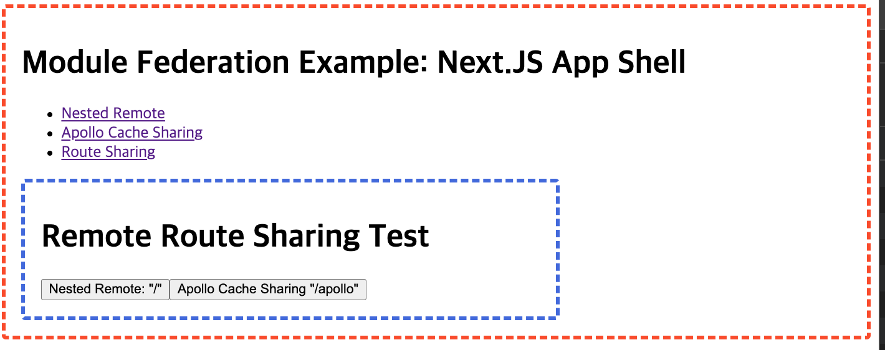
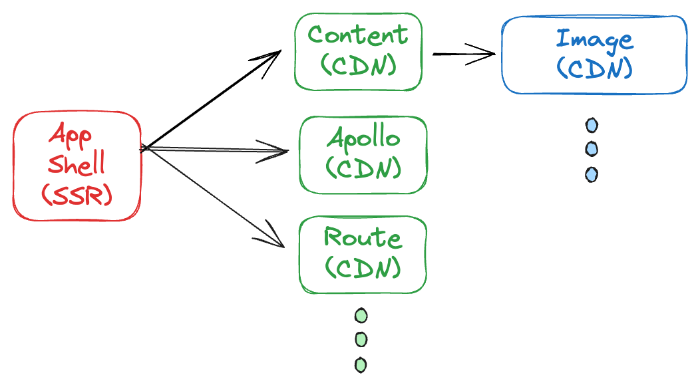

# Frontend Federation Modules Example

NextJS를 앱 쉘(Host)로 사용하며 React Client Side App을 Module(Remote)로 사용하여 구현하였습니다.

## Architecture


## Getting Started

http://localhost:3000/ 에서 확인하실 수 있습니다.

```
# install packages
$ yarn install

# javascript
$ yarn start

# or typescript
$ yarn start-ts
```

## 예제 케이스

### Nested Component & State Sharing

빨간색 박스는 App Shell(Host)로 전체 앱의 라이프사이클과 상태를 관리하는 컨테이너 입니다.

녹색의 박스는 Remote 모듈로 Host에서 Remote의 컴포넌트를 불러와 사용할 수 있습니다.

녹색 박스 또한 다른 Remote의 모듈(파란 박스)을 가져올 수 있습니다.



각 모듈은 순서대로 불러오고 사용합니다. 아래는 불러오는 플로우 입니다. 이를 응용하여 디자인 시스템이나 코어 컴포넌트를 모듈로 만들고 해당 모듈을 각 Remote 모듈에서 공유하여 사용할 수 있습니다.



모듈간 상태는 공유가능하며 상태를 양방향으로 전달하여 하위 컴포넌트의 상태를 변경시키거나 정보를 전달할 수 있습니다.



### Apollo Cache Sharing

NextJS 서버에서 호출된 Apollo Query의 경우 클라이언트 로드 시 동일한 요청에 대해 캐시되어 다시 호출이 되지 않도록 되어야 합니다. 이를 위해서 module federation의 shared singleton 기능이 잘 동작되어야 합니다.

빨간 박스 App Shell(Host)은 Remote의 파란 박스 컴포넌트를 불러오고 데이터를 전달하여 화면을 렌더링 합니다.



<div style="display:flex;width:100%;">
  <div style="padding:1em;width:0;flex-grow:1;">
    
    서버에서 이미 호출되어 캐시 되었을 경우 Remote 로드 시 바로 화면 갱신
  </div>
  <div style="padding:1em;width:0;flex-grow:1;">
    
    캐시가 안되면 graphcdn.app에 다시 호출하고 화면을 갱신
  </div>
</div>

### Router Sharing

Remote에서 Host의 라우팅을 전환하거나 제어할 수 있어야 합니다. 이를 위해서 공통으로 사용되는 라우터 라이브러리를 사용해야 하며 react 기반이기 때문에 라우터를 사용하는 모든 모듈의 경우 [react-router-dom](https://reactrouter.com/)을 사용해야 하도록 강제 합니다.

Remote 모듈에서 react-router-dom을 사용하여 라우팅 변경시 전체 App Shell Routes 설정에 따라 경로가 잘 이동이 되어야 합니다.



## 결론

위 예시 사항을 토대로 마이크로 프론트엔드 접근 방식(AD, Architectural Decision)에서 결정한 아키텍처를 구현할 수 있으며 공유할 모듈과 앱 상태를 결정하여 하나의 거대 앱을 마이크로 모듈로 각자 구현하고 배포하여 앱을 구현할 수 있습니다.


